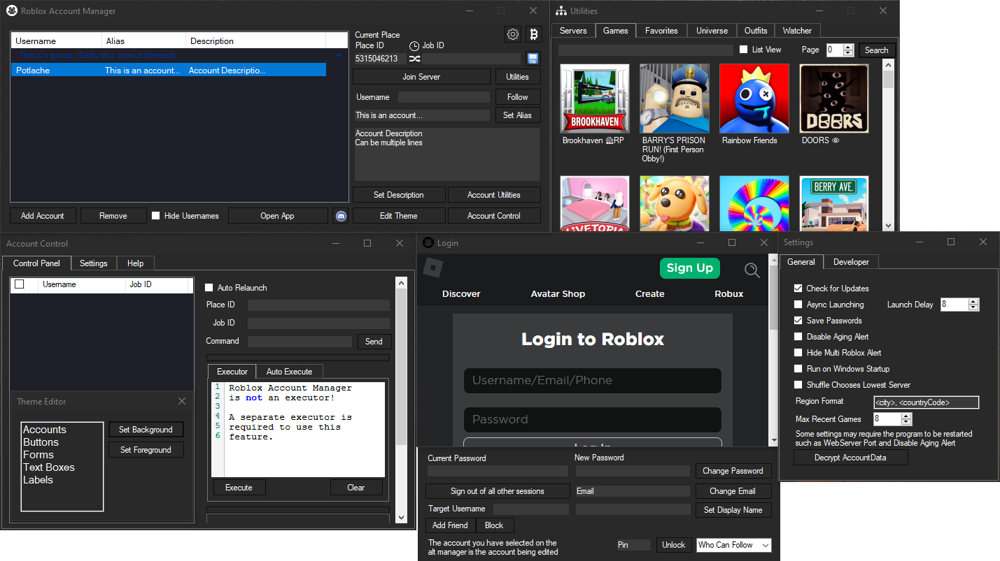
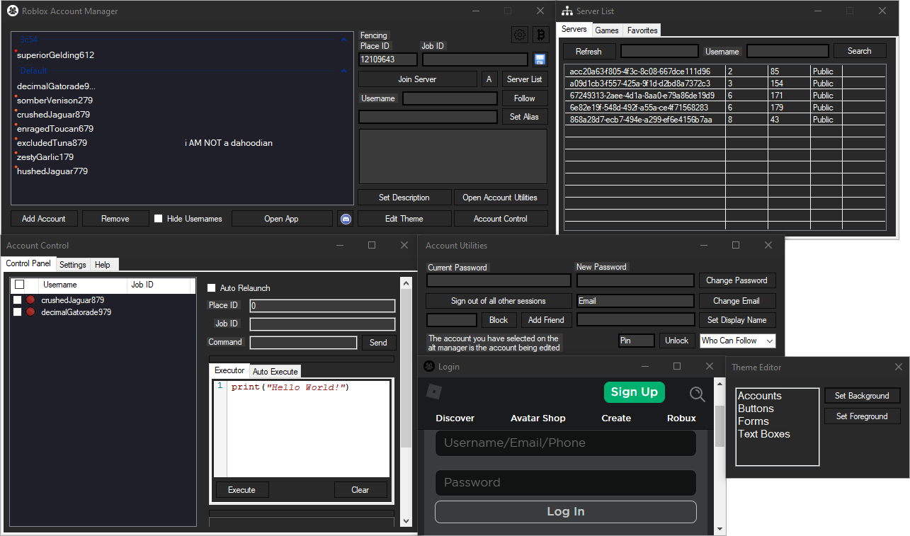
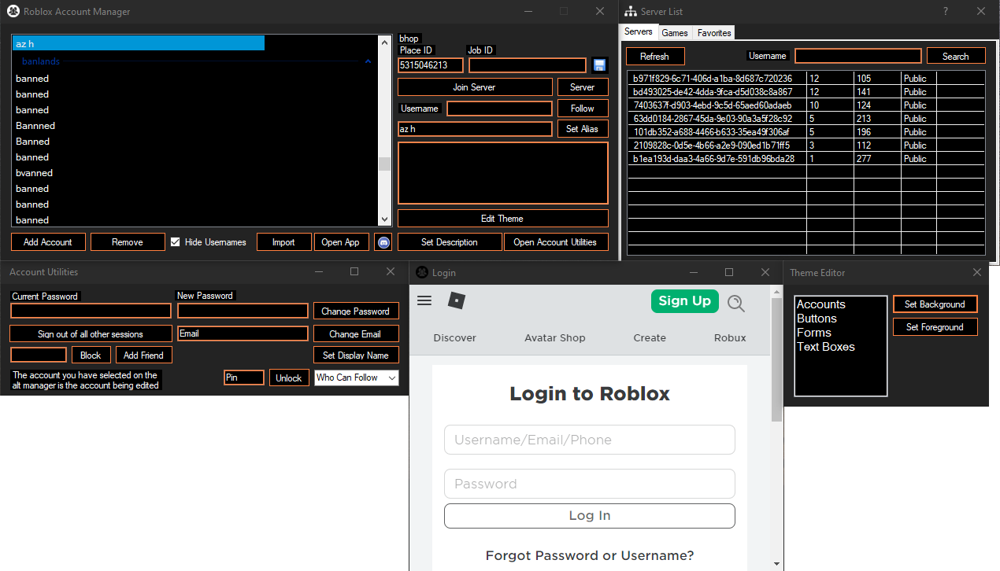
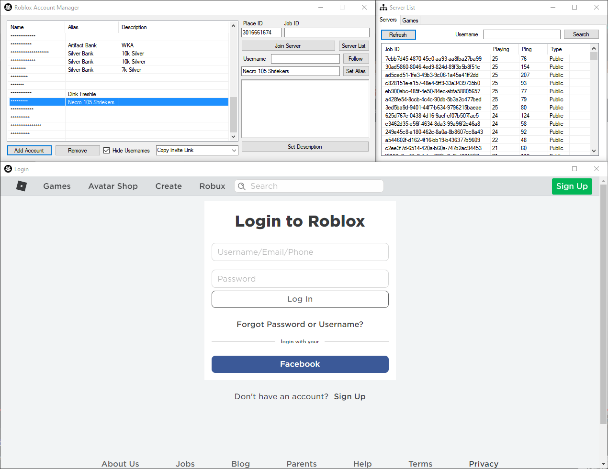

<!-- BEGIN LATEST DOWNLOAD BUTTON -->

<!-- END LATEST DOWNLOAD BUTTON -->

[Click here to view Roblox Account Manager features](https://github.com/ic3w0lf22/Roblox-Account-Manager/blob/master/README.md#features)

# Roblox Account Manager
Application that allows you to add multiple accounts into one application allowing you to easily play on alt accounts without having to change accounts

Useful for games that require grinding off other players, or storage accounts that hold in game items or currency, or just to have multiple accounts that you can easily find and use.

You are welcome to edit the code and create pull requests if it'll benefit this project.

Multiple Roblox Instances is built into the account manager but [must be manually enabled](https://github.com/ic3w0lf22/Roblox-Account-Manager/blob/master/README.md#q-how-do-i-enable-multi-roblox).

Report bugs to the issues section or direct message me via discord @ ic3#0001 or join the discord: https://discord.gg/MsEH7smXY8

# WARNING
If someone asks you to generate an "rbx-player link", **DO NOT** do it, they can use these to join any game using your account, or even launch roblox studio with one of your games. They can do many things in game such as spend your robux or even do things that can get your account terminated. **USE THESE FEATURES AT YOUR OWN RISK**

# Extra Features
Extra features can be enabled by setting DevMode=false to DevMode=true in RAMSettings.ini
Beware of the risks that you are taking if you accidentally send something to someone.

If you ever want a friend to join a game using your account, make sure you have the PlaceId and JobId correctly entered, then right click an account, and click "Copy rbx-player link", DO NOT do this if someone asks you for it.

# Download
To install this, head over to the [Releases](https://github.com/ic3w0lf22/Roblox-Account-Manager/releases) section and download the rar file at the very top, once downloaded, extract the files into a folder on your desktop and run RBX Alt Manager.exe.

If the application isn't starting or not working, make sure to install the [Latest .NET Framework](https://dotnet.microsoft.com/download/dotnet-framework).
Still having issues? Download and install [vcredist](https://aka.ms/vs/16/release/vc_redist.x86.exe)

# Developer API
To view the documentation, [click here](https://ic3w0lf22.gitbook.io/roblox-account-manager/).
Change the webserver port if you are planning on using any dangerous functions!
Be careful executing random scripts when having dangerous settings enabled.

# Frequently Asked Questions
## **Q:** Why is this program detected as a virus?

**A:** Open source programs such as this program are commonly detected as viruses because actual malware may be using the same libaries as this one. For example, account manager may be detected as a RAT because of the Account Control feature, this feature uses [websockets](https://github.com/ic3w0lf22/Roblox-Account-Manager/blob/master/RBX%20Alt%20Manager/Nexus/WebsocketServer.cs) to connect to clients which is the same way actual malware may use to connect maliciously to someone elses computer. If you'd like, you can download [visual studio](https://visualstudio.microsoft.com/downloads/) yourself (it's free) and compile this program on your own, you may even get the same virus detections as the public release.

## **Q:** How do I enable multi-roblox?

**A:** Open the settings menu by clicking the gear/cog icon in the top right, in the `General` tab, you will see a checkbox for `Multi Roblox`, make sure you have Roblox closed, then check the checkbox.

## **Q:** Why was multi-roblox disabled by default?

**A:** A byfron developer has stated that using multiple clients may be considered as malicious behavior, so I have decided to disable mutli-roblox by default and instead have users enable the option manually at their own risk.

## **Q:** Why am I getting CefSharp.Core.Runtime.dll/Object reference not set errors, how do I fix it?

**A:** Download the x86 version from https://docs.microsoft.com/en-US/cpp/windows/latest-supported-vc-redist | On an older OS? Try downloading [older versions of vcredist](https://docs.microsoft.com/en-US/cpp/windows/latest-supported-vc-redist?view=msvc-170#visual-studio-2013-vc-120) by scrolling down on or clicking the link | If that doesn't work, download the latest .NET Framework from https://dotnet.microsoft.com/download/dotnet-framework

## **Q:** Why do my accounts have yellow/red dots on them?

**A:** The yellow-red dots that appear on an account means that account hasn't been used in over 20 days, as that day counter goes up, the dot appears more red. You can get rid of this dot by joining a game or enabling developer mode and clicking "Get Authentication Ticket" when you right click an account (works with multiple).

## **Q:** How do I backup my accounts file?

**A:** Download [RAMDecrypt](https://github.com/ic3w0lf22/RAMDecrypt) and follow the instructions provided, then you can save the fully decrypted file in google drive, on a flash drive, or where ever you'd like. This does **NOT** work on files that didn't originate from your PC.

## **Q:** How do I prevent Windows Defender from deleting alt manager files?

**A:** Add an exclusion for the Roblox Account Manager folder, here's a video on how to add an exclusion: https://youtu.be/1r93NtwZt4o

## **Q:** Can I join vip servers using alt manager?

**A:** Yes you can, just make sure the place id is the same as the game you're trying to join, then paste the whole vip server link into the Job ID box and press Join Server

## **Q:** Are there docs for the API?

**A:** Yes, there are Docs: https://ic3w0lf22.gitbook.io/roblox-account-manager/

## **Q:** My anti virus detects this program as a virus. Should I not use it?

**A:** No. This program is in no way malicious, it's source code is fully available & trusted by a lot of people in the community. Some anti-virus programs may detect Account Manager as malicious because of the auto update function (a similar thing happens with Roblox Studio Mod Manager as well)

## **Q:** Can you use this on Mac?

**A:** No, unfortunately we do not have compatibility with mac osx devices at this moment. This may change in the future.

## **Q:** You should add ${feature}.

**A:** If you have a idea or a request for a feature you can submit such ideas/requests in suggestions

## **Q:** I’ve encountered a bug/issue on this software

**A:** If you have a bug or issue please explain your issue with screenshots (if possible) and/or a highly descriptive explanation in bugs we will try to get back to you ASAP.
Make sure you click "Open Details" before screenshotting. Please make sure your output is in English.

## **Q:** I can’t launch multiple accounts repeatedly.

**A:** This is due to Roblox’s rate limiting

## **Q:** Adding an account doesn't work

**A:** Restart the program, this issue will be fixed next update

## **Q:** Can you get banned for using this?

**A:** No, you cannot get banned for using this as this does not break Roblox T.O.S although some games may disallow you from having alt accounts so please do your research if you are unsure.

## **Q:** My AccountData file gets corrupted often
**A:** This is due to ProtectedData failing sometimes. You can disable encryption by creating a file called `NoEncryption.IUnderstandTheRisks.iautamor`. Do this at your own risk, nobody except yourself is responsible for your accounts!

# Features
| Feature | Description | How to |
| :--- | :---: | ---: |
| Account Encryption | All your account data is locally encrypted using your computer as the **password/key** meaning if someone else gets a hold of your account data, they will **NOT** be able to decrypt it unless you decrypted it yourself and shared it | **DO NOT SHARE YOUR `AccountData.json` FILE AT ALL |
| Password Encryption | Use a password to encrypt your data | This is recommended as it allows you store your data safely in google drive/similar and won't get corrupted due to you switching computers |
| [Multi Roblox](https://github.com/ic3w0lf22/Roblox-Account-Manager/blob/master/README.md#q-how-do-i-enable-multi-roblox) | [DISABLED BY DEFAULT, READ FAQ] RAM comes with a built-in multi Roblox allowing multiple Roblox clients to be open at once | **If this doesn't work for you, make sure no Roblox processes are running in the background by checking in task manager, then restart RAM** |
| Load Region | See where a server is located and get an accurate ping reading | Right click a server in the `Server List`, then click `Load Region` **(Requires a valid account to be selected in the main window)** |
| Server List | See a game's servers, including the servers' data such as player count and server ping | Click `Server List` on the right side of the main window |
| [Join Small Servers](https://youtu.be/Red66cV6vVI) | Easily join small servers in games that use lobby starter places to teleport you to another game | Insert the actual game's PlaceId into the text box next to `Refresh` in the `Server List`, click `Refresh`, then right click a server and click `Join Game`, you will hear a beep if successful, once you hear that beep, you can join the main game |
| Account Utilities | Easily change your account password, email, follow privacy, etc | Click `Account Utilities` in the main window **(Requires a valid account to be selected in the main window)** |
| Account Sorting | Sort your accounts easily | Simply drag and drop an account on the list |
| Account Grouping | Sort your accounts by groups, you can also drag and drop accounts into other groups | Right click an account, hover over `Groups`, then click `Move account to` |
| Group Sorting | Sort groups from top to bottom by assigning numbers to them | When creating a group, you can put a number from 0-999 (ex. `1Main`, `007 Bank`, `67 Dead`, ...), sorted from smallest to largest, the numbers will be hidden afterwards |
| Games List | Browse through thousands of games you normally wouldn't see on the front page | Click `Server List`, then `Games` |
| Favorite Games | Add your favorite games to a list you can easily navigate to | Click `Server List`, then `Favorites` |
| Recent Games | Saves your recently played games into the `PlaceId` text box | After joining a game, that game will be added to the recent games list, which you can then quickly load up by hovering over the clock icon above the `PlaceId` text box or by typing the game's name into the `PlaceId` text box in the main window |
| Open Browser | Open a browser window using the selected account, allowing you to various settings | Click `Open Browser` in the main window while having an account selected |
| Join VIP Servers |  | Simply place your entire VIP server link into the `PlaceId` text box and RAM will handle the rest |
| Shuffle JobId | Selects a random JobId for every account everytime you press "Join Server" unless you have a JobId set | Click the shuffle icon to toggle JobId Shuffler |
| Save PlaceId & JobId | Save specific `PlaceId`s and/or `JobId`s to specific accounts | Once you enter your desired PlaceId and/or VIP links, click the `Save` icon next to the `JobId` text box |
| Player Finder | Find a player even if their follows are off as long as you know what game they are in | In the `Server List` window, put a player's username into the `Username` text box, then click search. **This may take a while to load and may be patched in the near future** |
| Universe Viewer | View a game's universe | Open `Utilities`, then click `Universe` |
| Outfit Viewer | View other player's outfits and even wear their outfits | Open `Utilities`, then click `Outfits` |
| Sort Account by Usage Date | View the last time you used an account | Make sure to enable headers in the Theme Editor, right click the header and enable `Last Used`, then right click an account, hover `Groups`, and press `Toggle`. You can now click on `Last Used` in the header to sort the accounts. |
| Close Roblox Beta | Detects if the Roblox Beta Home Menu is open and terminates the process if so | Open `Utilities`, then click `Watcher` to modify settings |
| Prevent Duplicate Instances | Automatically shuts down old instances when you launch an account | Account Manager automatically assigns a number called `BrowserTrackerID` to each account allowing it to know if there is an active instance of that specific account running, then proceeds to close it preventing instances of the same account opening more than once |
| Save Passwords | Upon logging into an account, RAM will automatically save that accounts password which can then be copied by right clicking the account, then selecting `Copy Password` | This can be disabled by clicking the settings button (gear cog in top-right corner), the unchecking `Save Passwords` |
| Themes | Customize RAM to your liking (P.S. I know it's very ugly, not much I can do about it with WinForms) | Click `Edit Theme` in the main window |
| Developer Mode | Enable hidden features not available to normal users for safety reasons | Click the settings button (gear cog in top-right corner), click `Developer`, then check the `Enable Developer Mode` box |
| Local Web API | Easily use many RAM features by making a simple http request | [Documentation](https://ic3w0lf22.gitbook.io/roblox-account-manager/) |
| Account Control | Control your in-game accounts using the `Account Control` window in RAM | Click `Account Control` in the main window - [Documentation](https://github.com/ic3w0lf22/Roblox-Account-Manager/blob/master/RBX%20Alt%20Manager/Nexus/NexusDocs.md) |
| Import Cookies | Import accounts using their .ROBLOSECURITY cookies | You can drag and drop one or multiple cookies directly into the program, or you can enable developer mode and use the `Import` window |
| FPS Unlocker | Unlocks the Roblox client's FPS using Roblox's ClientAppSettings.json | Settings can be found by clicking the settings cog, then miscellaneous |
| Bulk User Importing | Easily import your accounts by their username & password combos, or by cookies | Click the arrow on the right side of the `Add Account` button, then select user:pass/cookies |
| Automatic Connection Loss Detection | Closes instances that are not connected to a server for a certain amount of time | To enable this, go to `Utilities`->`Watcher`, and make sure `Enable Roblox Watcher` is checked as well as `Exit if No Connection to Server` |
| Automatic Cookie Refresh | Your accounts never become invalidated sitting in the account manager over long periods of time | As long you actively use account manager, your accounts will regularly get new cookies preventing them from being logged out, this does sign you out of other sessions though |
| Join Group | Easily join groups with multiple accounts | Click the arrow on the right side of the `Open Browser` button, then click `Join Group` |
| Auto Relaunch | Automatically relaunch your accounts if they are not in game/have been AFK kicked | Watch a youtube tutorial on how to use this. If you do not have an executor that works with Nexus.lua: click `Account Control`, go to `Settings`, then enable `Use Presence API` |
| Quick Log In | Easily log in to an account on a different computer using Roblox's Quick Log In feature | Right click an account, then select `Quick Log In` |
| AI Captcha Assistance | Assists you in the "Pick the image" captchas using the Nopecha API (Requires a subscription key) | You can enable auto solve, but it is not recommended to use, your best option is to add a captcha solving extension to the browser along with a BrowserConfig to automatically set the key per new browser opened |

# Preview (Version 3.4)

# Preview (Version 3.1)

# Preview (Version 2.6)

# Preview (Old)

